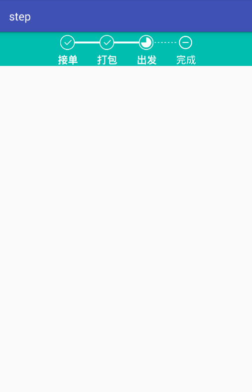
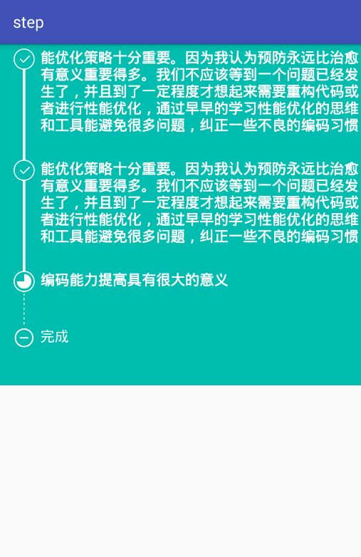

# StepView [](https://jitpack.io/#baoyachi/StepView)
Step indicator。

HorizontalStepView
</img>

VerticalStepView
</img>

### use HorizontalStepView

in xml

```java
	<step.xv.com.step_library.HorizontalStepsViewIndicator
            android:id="@+id/hsvi"
            android:background="#00BEAF"
            android:layout_width="match_parent"
            android:layout_height="wrap_content"/>
```
use code

```java
        hsvi = findViewById(R.id.hsvi);
        ArrayList<Info> list = new ArrayList<>();
        list.add(new Info("能优", Info.STEP_COMPLETED));
        list.add(new Info("化策",Info.STEP_COMPLETED));
        list.add(new Info("编码",Info.STEP_COMPLETEING));
        list.add(new Info("完成",Info.STEP_UNDO));
```
```java
    自定义的属性
<declare-styleable name="HorizontalStepsViewIndicator">

        <attr name="unCompleteTextColor" format="color|reference"/>//未完成文字的颜色
        <attr name="completedTextColor" format="color|reference"/>//完成文字的颜色
        <attr name="completeingTextColor" format="color|reference"/>//进行中文字的颜色

        <attr name="unCompleteTextSize" format="dimension|reference"/>//未完成文字的大小
        <attr name="completedTextSize" format="dimension|reference"/>//未-完成文字的大小
        <attr name="completeingTextSize" format="dimension|reference"/>//进行中文字的大小

        <attr name="unCompleteTextBlod" format="boolean|reference"/>//未完成文字的是否加粗
        <attr name="completedTextBlod" format="boolean|reference"/>//完成文字的是否加粗
        <attr name="completeingTextBlod" format="boolean|reference"/>//进行中文字的是否加粗

        <attr name="unCompleteIcon" format="color|reference"/>//未完成的图标
        <attr name="completedTextIcon" format="color|reference"/>//完成的图标
        <attr name="completeingTextIcon" format="color|reference"/>//进行中的图标

        <attr name="unCompleteLineColor" format="color|reference"/>//未完成线的颜色
        <attr name="completedLineColor" format="color|reference"/>//完成线的颜色

        <attr name="unCompleteLineHeight" format="dimension|reference"/>//未完成线的高度
        <attr name="completedLineHeight" format="dimension|reference"/>//完成线的高度

        <attr name="unCompleteLineKind">//未完成线的种类
            <enum name="straightLine" value="1"/>
            <enum name="dottedLine" value="2"/>
        </attr>
        <attr name="completedLineKind">//完成线的种类
            <enum name="straightLine" value="1"/>
            <enum name="dottedLine" value="2"/>
        </attr>
        <attr name="leftGap" format="dimension|reference"/>//左边的间隙
        <attr name="topGap" format="dimension|reference"/>////顶部的间隙
        <attr name="circleRadius" format="dimension|reference"/>//圆环的半径
        <attr name="lineLength" format="dimension|reference"/>//连接线的起始长度
        <attr name="iconAndTextGap" format="dimension|reference"/>//图标和文字之间的距离


    </declare-styleable>
```
